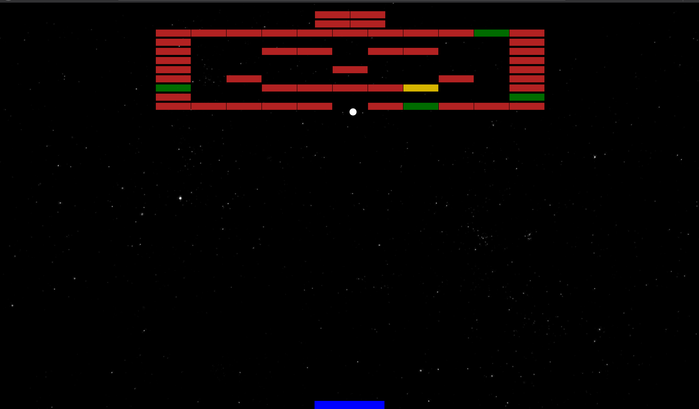
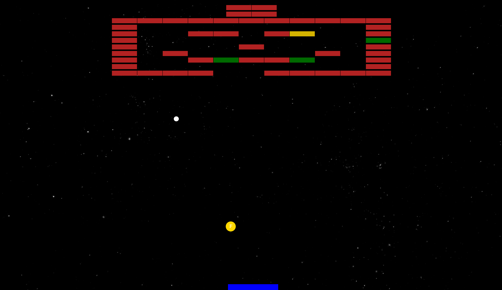

# Multilevel-Ballbrick-Game
This game is made using vannila js and no canvas, As it is designed in module form, anyone can clone this repo and customize easily || Demo in [@live demo](https://karthiknedunchezhiyan.github.io/Multilevel-Ballbrick-Game/src/index.html) || You can also use this [@Multilevel-Ballbrick-game](https://github.com/KarthikNedunchezhiyan/Multilevel-Ballbrick-Game) as a playground to practice Machine Learning || Check my other works [@MyRepos](https://github.com/KarthikNedunchezhiyan) || To know more about Ball Bricker game [@WiKi](https://en.wikipedia.org/wiki/Brick_Breaker)

## Configurations

Parameter | value
--- | ---
Special Power Probalility | 0.1
Ball Speed | 5
Powers | fireball,rowblast
Max Level | 3

## Screenshots

    
    <em>Level 1</em>

    
    <em>Fireball Power</em>

  
View in https://github.com/KarthikNedunchezhiyan/Multilevel-Ballbrick-Game

## Meta

Karthik Nedunchezhiyan – [@Github](https://github.com/KarthikNedunchezhiyan) – karthik1705.n@gmail.com

Distributed under the MIT license. See ``LICENSE`` for more information.

## Contributing

Suggestions are always welcome
